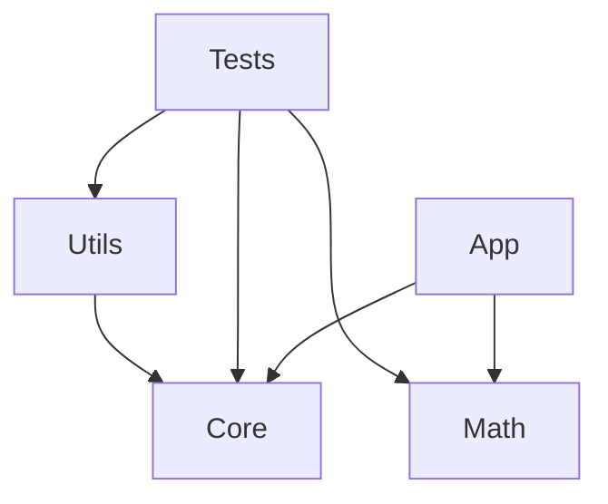

# C++ Multi-Module Project

## Project Structure
- **core**: Fundamental mathematical operations
- **math**: Basic arithmetic functions
- **utils**: Common utilities (logging, string manipulation)
- **app**: Main application executable
- **tests**: Google Test integration

## Build Instructions
```bash
mkdir build
cd build
cmake .. -G "Visual Studio 16 2019" -A x64
cmake --build . --config Release
```

## Running Tests
```bash
cd build
ctest -C Release
```

## Module Dependencies
